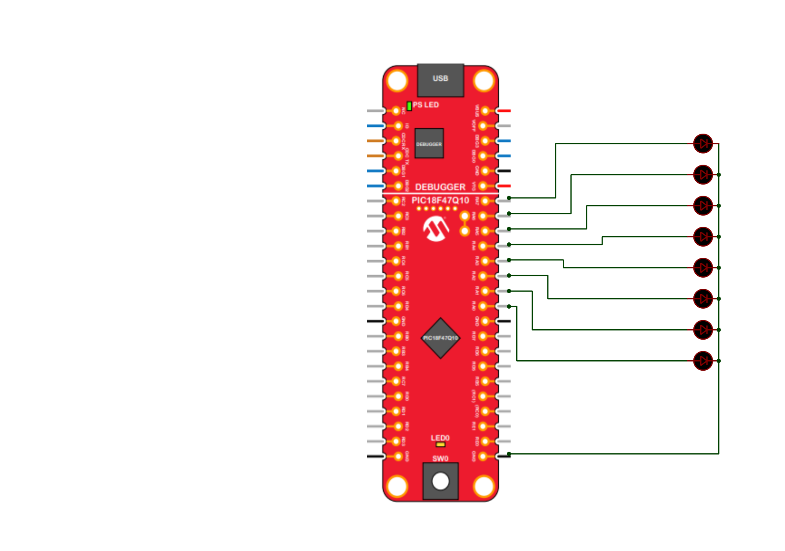

# PIC18F47Q10 - Hardware

- [Binary_counter_button](./Binary_counter_button.X)
  - Each time the button is pressed, the binary number is incremented by 1. \
    
    
  - If the button is pressed longer then 1.5s the binary number is reset. \
    

- [Binary_counter_timer](./Binary_counter_timer.X)
  - About ~1s, the binary number is incremented by 1. \
    
